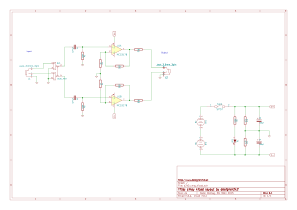

# kicad-cmoy
cmoy headphone amplifier in kicad

## Schematic:

Created by http://www.designer2k2.at

## Details:
cmoy is a simple but great headphone amplifier, original creator: http://headwize.com/?page_id=707

Here is a working archived copy from the headwize website: http://web.archive.org/web/20150415003947/http://headwize.com/?page_id=707
